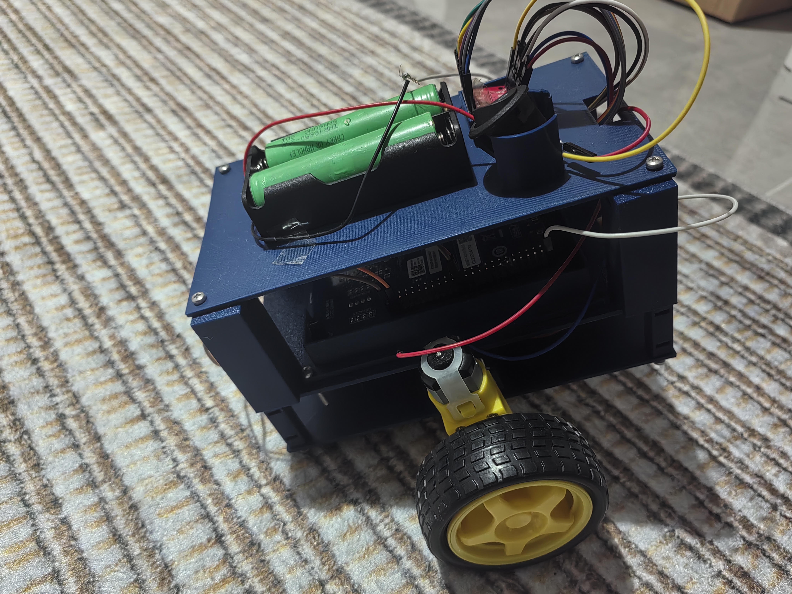

# stm32-balancebot

A two-wheeled self-balancing robot built on an **STM32F407G-DISC1** board. All of the firmware is **bare-metal C with direct register access**: no HAL, no Arduino, and no drivers from anyone else. Clocks, timers, PWM, UART, I2C and the IMU driver all set up the hardware registers directly.

<p align="center">
  <!-- Photo goes here: save it as docs/bot.jpg (or change the path below) -->
  
</p>

> 🚧 **Work in progress.** The sensing and motor parts both work on the real hardware. The balance loop (PID) is next.

---

## Features

| Part | What it does | Status |
|---|---|---|
| Clock tree | 8 MHz HSE → PLL → 168 MHz SYSCLK, flash wait states, APB prescalers | ✅ |
| SysTick | 1 ms interrupt, `millis()` timer that doesn't block | ✅ |
| UART debug | USART2 at 115200 baud, `printf` sent out through `_write()` | ✅ |
| I2C driver | I2C1 at 100 kHz: single-byte read, register write, 14-byte burst read | ✅ |
| IMU | MPU6050-compatible (the board actually has an MPU6500, `WHO_AM_I = 0x70`). Accel in g, gyro in °/s | ✅ |
| Sensor fusion | Complementary filter (α = 0.96) that combines the accel angle and the integrated gyro rate | ✅ Tested by tilting it by hand |
| Motor PWM | TIM3 CH1/CH2 at 10 kHz, TB6612FNG direction logic, brake and coast | ✅ |
| Balance control | PID on the filtered tilt angle → motor commands | ⏳ Next |

## Hardware

- **MCU:** STM32F407G-DISC1 (STM32F407VG, Cortex-M4F, 168 MHz)
- **IMU:** MPU6050 breakout (the chip on it is an MPU6500)
- **Motor driver:** TB6612FNG dual H-bridge
- **Motors:** 2× TT gear motors with encoders, plus wheels
- **Power:** 2S 18650 pack (Samsung INR18650-25R, about 7.4 V nominal) on VM. Logic runs from the board's supply.
- **Debug:** USB-to-TTL serial adapter. The ST-Link on the F407 Discovery has **no** virtual COM port.

## Pinout

| STM32 pin | Peripheral | Connected to |
|---|---|---|
| PA2 | USART2_TX (AF7) | USB-TTL RX |
| PA3 | USART2_RX (AF7) | USB-TTL TX |
| PB6 | I2C1_SCL (AF4, open-drain) | MPU SCL |
| PB7 | I2C1_SDA (AF4, open-drain) | MPU SDA |
| PA7 | TIM3_CH2 (AF2) | TB6612 PWMA |
| PA6 | TIM3_CH1 (AF2) | TB6612 PWMB |
| PE7 | GPIO out | TB6612 STBY |
| PE8 / PE9 | GPIO out | TB6612 AIN1 / AIN2 |
| PE10 / PE11 | GPIO out | TB6612 BIN1 / BIN2 |

> ⚠️ **VM and VCC are separate rails on the TB6612.** VM goes to the battery pack and VCC goes to the logic supply. The battery ground and the board ground must be connected together.

## Build & flash

This is a [PlatformIO](https://platformio.org/) project (`ststm32` platform, `stm32cube` framework, flashed through the onboard ST-Link).

```bash
pio run                  # build
pio run -t upload        # flash via ST-Link
pio device monitor       # serial output at 115200 baud (via the USB-TTL adapter)
```

`-Wl,-u,_printf_float` is set in `platformio.ini`, so `printf("%f")` works.

### Simulation (Renode)

[`motor_test.resc`](motor_test.resc) is a [Renode](https://renode.io/) script. It runs the firmware on a simulated STM32F4 and logs every GPIOE access. You can use it to check the motor driver's STBY and direction pin patterns without any hardware connected.

```bash
renode motor_test.resc
```

## Project structure

```
├── src/main.c          # all firmware: clock, SysTick, UART, I2C/IMU, filter, motor control
├── motor_test.resc     # Renode simulation script
├── platformio.ini      # build / upload config
└── docs/               # images
```

## Roadmap

- [x] UART debug output
- [x] 168 MHz clock tree
- [x] SysTick millisecond timer
- [x] Bare-metal I2C and IMU readout
- [x] Complementary filter
- [x] Motor PWM and direction control
- [ ] Connect the filter to the main loop at a real control rate (50–200 Hz)
- [ ] Find the correct gyro axis once the IMU is mounted
- [ ] PID balance controller and tuning
- [ ] Read the wheel encoders
- [ ] Reinforcement-learning controller to compare against PID (a follow-up project)
